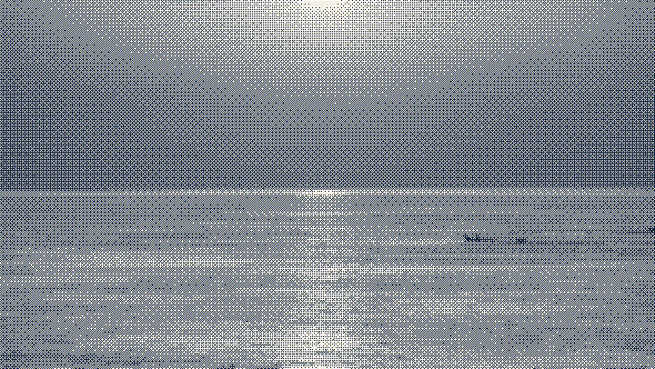

# Hi, I’m Thoriq.

_An animated excerpt from [“Ocean surface waves 06”](https://commons.wikimedia.org/wiki/File:Ocean_surface_waves_06.ogv) by [Mostafameraji](https://commons.wikimedia.org/wiki/User:Mostafameraji), available under [CC0 1.0](https://creativecommons.org/publicdomain/zero/1.0/)._

I’m an AI product engineer based in Indonesia. I build AI products end to end—from agent behaviour and backend systems to the interfaces people use.

Right now, I’m building P&AI at [Pandai](https://pandai.org), a learning agent for students across Malaysia and Brunei. I’ve also worked across messaging, web, mobile, and AI products, and previously helped grow Pandai’s organic traffic ninefold.

I write about AI, software, and the things I’m making at [rethoriq.vercel.app](https://rethoriq.vercel.app).
